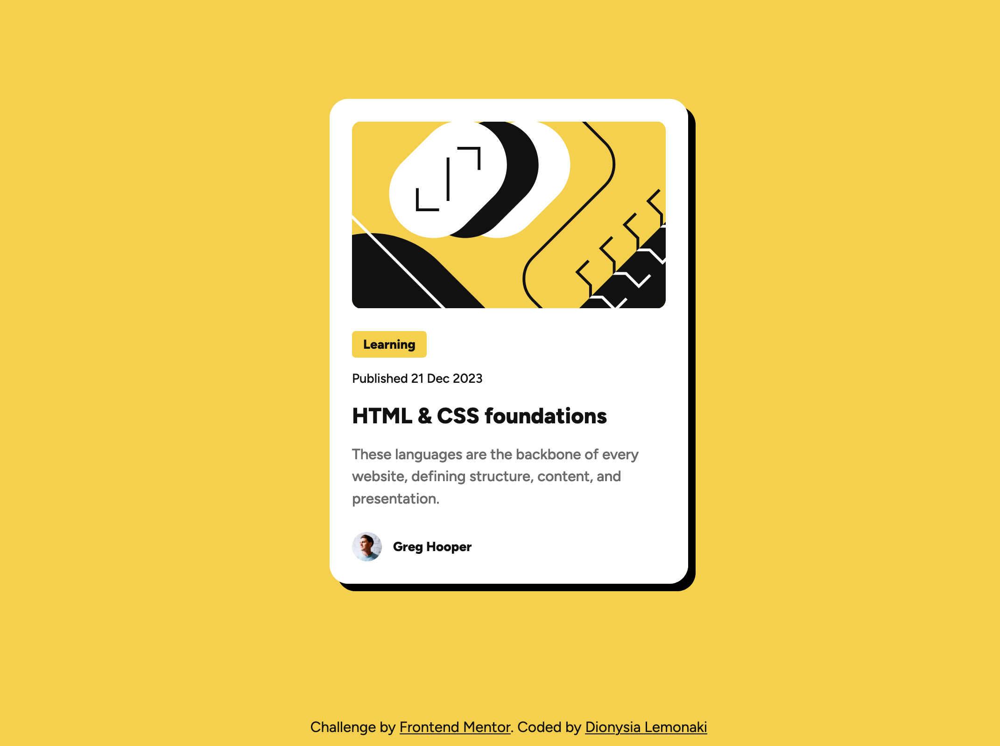

# Frontend Mentor - Blog preview card solution

This is a solution to the [Blog preview card challenge on Frontend Mentor](https://www.frontendmentor.io/challenges/blog-preview-card-ckPaj01IcS). 
## Table of contents

- [Overview](#overview)
  - [The challenge](#the-challenge)
  - [Screenshot](#screenshot)
  - [Links](#links)
- [My process](#my-process)
  - [Built with](#built-with)
  - [Useful resources](#useful-resources)
- [Author](#author)
- [Acknowledgments](#acknowledgments)

## Overview

### The challenge

Users should be able to:

- See hover and focus states for all interactive elements on the page

### Screenshot

### Links

- [Solution URL](https://www.frontendmentor.io/solutions/blog-preview-card-PxTIEiN_T5)
- [Live site URL](https://fem-blog-preview-card-ashen.vercel.app/)

## My process

### Built with

- Semantic HTML5 markup
- CSS custom properties
- Flexbox

### Useful resources

- [Utopia Clamp Calculator](https://utopia.fyi/clamp/calculator/?a=0,0) - This tool helped me generate responsive font sizes using the `clamp()` function.
- [Getting started with Variable fonts on the web](https://www.youtube.com/watch?v=0fVymQ7SZw0) - This video by Kevin Powell was a great introduction to variable fonts.
- [Cards](https://inclusive-components.design/cards/#thepseudocontenttrick) – This article by "Inclusive components" that was shared on Frontend Mentor's Discord helped me make the whole card clickable.

## Author

- [Frontend Mentor profile](https://www.frontendmentor.io/profile/dionysia-lemonaki)
- [LinkedIn profile](https://www.linkedin.com/in/dionysia-lemonaki-developer/)